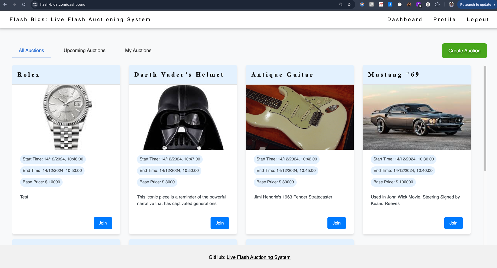
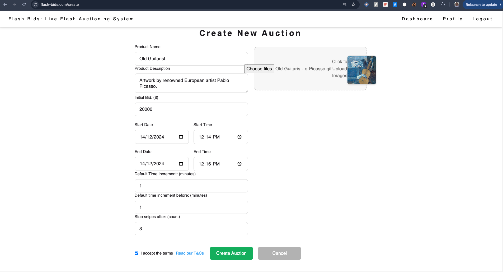
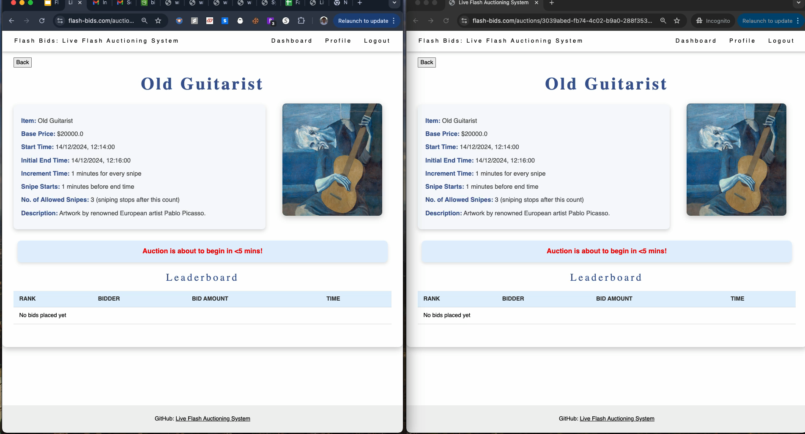
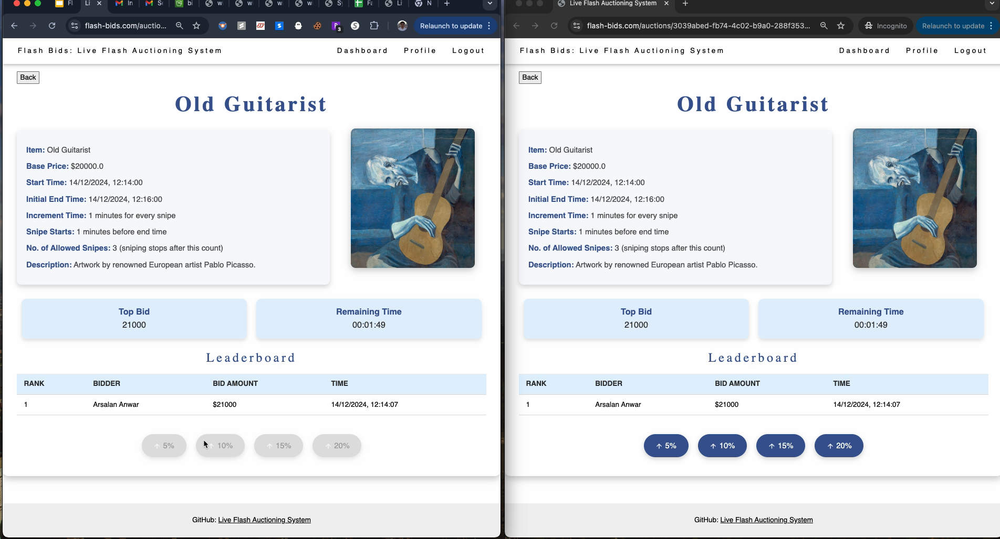
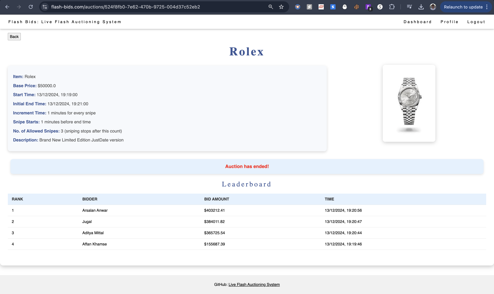
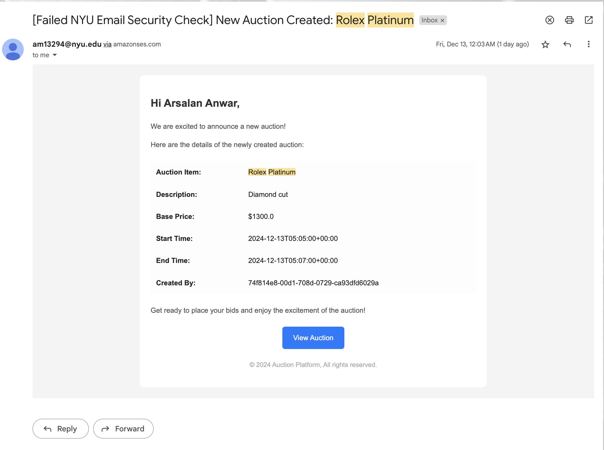
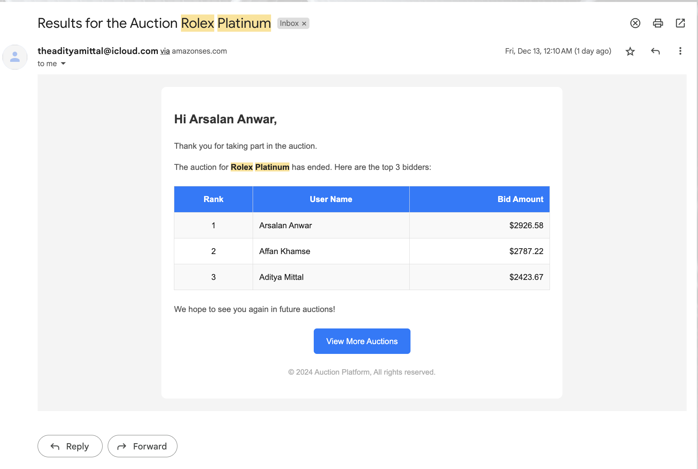

# Live Flash Auctioning System
[](https://github.com/arsalananwar11/Live-Flash-Auctioning-System/actions/workflows/lint.yml)

The Live Flash Auctioning System is an innovative platform that facilitates real-time auctions with minimal latency. Auctioneers can host live auctions, engaging participants globally. The platform ensures fair bidding practices through synchronized countdown timers and instant notifications, allowing users to participate from any location seamlessly.

## Links: 
1. Youtube: [Flash Bids - Demo](https://www.youtube.com/watch?v=1CKX-AoVIIA)
2. Presentation: [Flash Bids - Presentation](https://docs.google.com/presentation/d/1Sxxo-XUdzIUrEROpRjtokvlWoqexPxSIyaKut3UiJvo/edit?usp=sharing)

## Architecture

The architecture of the project is visualized in the diagram below:


## Product Features:
1. ### Real-Time Bidding Interface:
- Auctioneers can input product details, including auction date, time, and duration.
- Users can view products at the specified times, see the number of bids placed, and participate in real-time bidding.
2. ### Bidding Mechanism:
- Participants can place bids in real-time using WebSockets for low-latency communication.
- The system efficiently handles concurrent bids, ensuring accuracy and fairness.
- The highest bidder at the end of the auction wins the item.
3. ### Dynamic Countdown Timer:
- A synchronized countdown timer is displayed to all users, ensuring fairness.
- Utilizes AWS Time Sync Service/Websockets for accurate timekeeping across all users.
4. ### Auction Notifications:
- Send personalized notifications to users about upcoming auctions.
- Send winner details and leaderboard to all auction participants
5. ### Sniping Prevention:
- If a bid is placed within the last 30 seconds, the auction timer extends automatically by a set duration (e.g., 1 minute).
- Extensions are communicated instantly to all participants, preventing last-second bidding advantages.
6. ### Scalability:
- Employs AWS EC2 with auto-scaling groups to adjust resources dynamically based on user traffic.
- Ensures consistent performance during peak times and cost-efficiency during low traffic periods.
7. ### Data Storage and Analysis:
- All bids, auction details, and timer extensions are stored in Amazon DynamoDB for record-keeping and analysis.
- Enables detailed analytics on bidding behavior and auction performance.
- Product images are stored in Amazon S3, ensuring fast and reliable media access.
8. ### User Authentication:
- Secure user authentication and management using AWS Cognito.
- Supports user profile management and interest tracking for personalized experiences.
9. ### Post Auction Analytics:
- After the auction ends, the bid history goes into the auction S3 bucket which can be used for analysis

## Architecture

The architecture of the project is visualized in the diagram below:


## Getting Started
Follow these steps to clone the repository and run the application locally with Black and Flake8 checks.

### Prerequisites

- Python 3.12
- pip

### Steps to Clone and Run the Project

  1. **Clone the Repository**
      ```bash
      git clone https://github.com/arsalananwar11/Live-Flash-Auctioning-System.git
      cd Live-Flash-Auctioning-System
      ```

  2. **Create a Virtual Environment**
      ```bash
      python3 -m venv venv
      source venv/bin/activate  # On Windows use `venv\Scripts\activate`
      ```

  3. **Install the requirements**
      ```bash
      pip install -r requirements.txt
      ```

  4. **Run the Application**
      ```bash
      flask run
      ```

## Steps to Contribute to the Project
  1. **Create a Branch for Your Feature or Fix**
      ```bash
      git checkout -b feature/<your-feature-name>
      ```

  2. **Run Black and Flake8 Checks**
      ```bash
      # Auto-format with Black
      black .

      # Check for linting issues with Flake8
      flake8 .
  3. **Commit Your Changes**
      ```bash
      git add .
      git commit -m "Add a brief description of your changes"
      ```
  4. **Create a Branch for Your Feature or Fix**
      ```bash
      git push origin feature/<your-feature-name>
      ```
  5. **Open a Pull Request**

      - Go to the repository and click on Pull Requests.
      - Click on New Pull Request and select your branch to submit your changes for review.
      - Wait for all the checks to pass and atleast one reviewer to approve your PR

## Tech Stack
- AWS Cognito for user authentication
- EC2 with Autoscaling groups to manage resources based on fluctuating user traffic
- AWS Load Balancer to handle large volumes of traffic
- WebSockets for low-latency real-time communication
- Amazon DynamoDB to store bids, auction product details, and leaderboards
- Amazon S3 to store any associated media (e.g., product pictures) and bid history for post auction analytics
- AWS RDS (Relational Database System) for structured auction data storage
- AWS EventBridge for triggers for Auction Infrastructure setup, Start and End Auction
- Amazon SES (Simple Email Service) for notifications to inform users about upcoming auctions
- Amazon SQS (Simple Queue Service) to accept bids from users, store notification mails to be sent to the users
- Amazon CloudWatch to monitor logs and overall execution


## Data Sources:
- User Sourced Data:
  - User Data: Collected during sign-up via AWS Cognito, including interests and optional location data. Used for personalized notifications and targeted advertisements.
  - Auction Data: Product details, auction schedules, and historical data stored in Amazon DynamoDB. Includes information on bids placed, timestamps, and auction outcomes.
  - Bidding Data: Real-time bid submissions handled through Amazon SQS for efficient processing. Stored for analysis and to ensure transparency in the bidding process.
  - Media Content: Product images and videos uploaded by auctioneers to Amazon S3. Ensures high availability and scalability for media assets.

## Existing Products:
1. eBay Live Auctions:
  - Offers live auction experiences but may lack synchronized countdown timers and advanced sniping prevention features.
  - Latency issues can affect the real-time bidding experience.
2. Invaluable:
  - Provides live auctions with real-time bidding capabilities.
  - Does not emphasize dynamic auction extensions to prevent sniping.
3. LiveAuctioneers:
  - Hosts live auctions for a global audience.
  - May face challenges with latency and does not fully address peak traffic scalability.

## Snippets:
1. Flash Bids Dashboard


2. Auction Creation


3. Auction about to start: Infrastructure being set up in the backend


4. Auction Bidding Mechanism: Leaderboard, Dynamic Countdown and Rate Limiting in action


5. Auction Ended: Bidding no longer accepted


6. Email Notifications: 
  - Upcoming Auctions: To all the users in the system (via SQS queue 2)
  

  - Auction Results and Leaderboard Details: To only the auction participants (via SQS queue 1)
  

